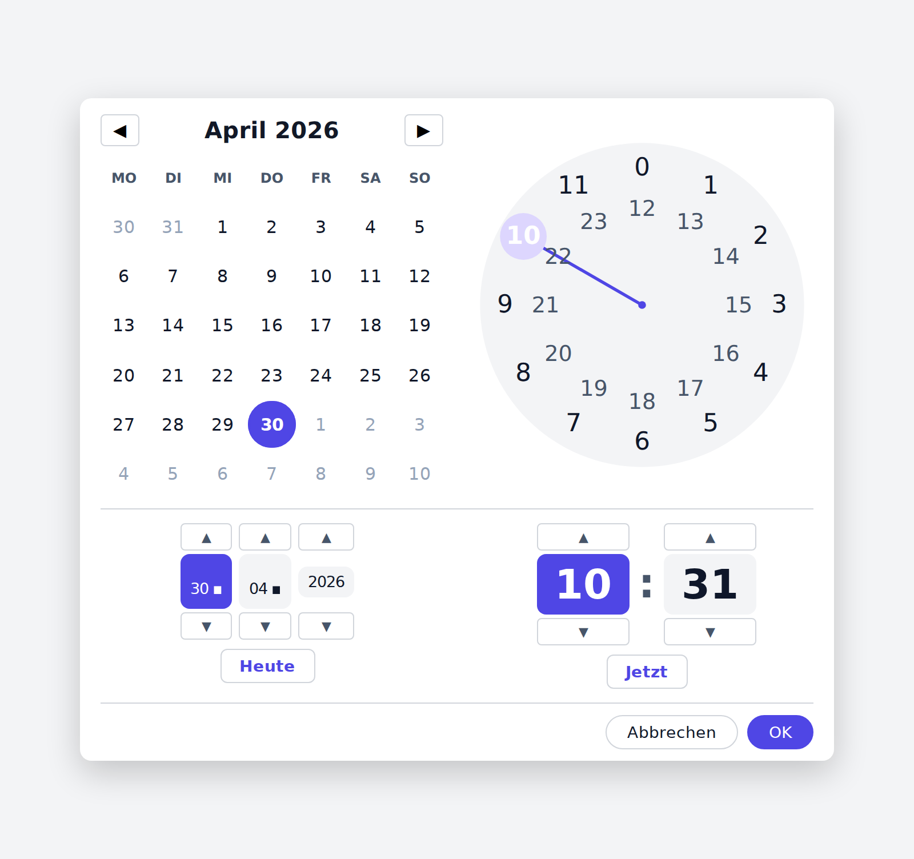

# DateTimePicker

A compact button-triggered date/time picker for React. Click the trigger,
fill in **Tag / Monat / Jahr / Stunde / Minute** in a popup with numeric
inputs (with arrow-key increment / decrement, mouse-wheel adjust, and clamp
on Enter), confirm to close. Designed for clinical-grade data entry where
the standard `<input type="datetime-local">` UX is too sloppy.

Inspired by the date/time picker from the Business Calendar 2 app.



## Install

This is published as a private repo. Add as a git dependency:

```jsonc
// package.json
{
  "dependencies": {
    "datetime-picker": "github:Ranudar/datetime-picker"
  }
}
```

Peer-dep: React ≥ 18 < 20.

## Usage

```tsx
import { useState } from 'react';
import { DateTimePicker } from 'datetime-picker';
import 'datetime-picker/DateTimePicker.css';

export function Example() {
  // value is a "datetime-local"-style string: YYYY-MM-DDTHH:MM
  const [value, setValue] = useState<string>('');
  return <DateTimePicker value={value} onChange={setValue} />;
}
```

## Props

| Prop | Type | Description |
|---|---|---|
| `value` | `string` | Current value, in `YYYY-MM-DDTHH:MM` (datetime-local) format. Empty string = unset. |
| `onChange` | `(value: string) => void` | Called when the user confirms the popup. Receives the new datetime-local string. |
| `id` | `string?` | Optional DOM id on the trigger button (handy for `htmlFor` labels). |
| `disabled` | `boolean?` | When true, the trigger renders read-only — the popup will not open. Useful for inherited / derived timestamps that shouldn't be edited directly. |

## Behavior notes

- Each numeric input (Tag, Monat, Jahr, Stunde, Minute) accepts only digits
  and clamps to a sensible range on blur or Enter.
- Mouse-wheel scrolling on a focused field bumps the value ±1.
- Day input is clamped to the current month's days (no Feb 30).
- Invalid date strings in `value` reset to "unset" rather than throwing.
- The popup closes on Esc, on overlay click, and on confirm.
- The component owns all state internally — no controlled-popup props needed.

## Demo

[**Live demo →**](https://ranudar.github.io/datetime-picker/) (GitHub Pages)

A fully self-contained `index.html` (~210 KB) ships in the repo root.
React, ReactDOM, the component, and the styles are all inlined — no CDN
calls at runtime, no build step, no install. Just download the file and
open it in a browser.

## Files

- `src/DateTimePicker.tsx` — the React component plus all parsing /
  formatting helpers. ~540 lines, no dependencies beyond React.
- `src/DateTimePicker.css` — the popup styling. Scoped under `.dtp-popup`
  selectors so it shouldn't fight your app's CSS.
- `index.html` — fully self-contained demo (React + DateTimePicker + CSS
  bundled inline, minified, NODE_ENV=production).
- `e2e/picker.spec.ts` — Playwright end-to-end tests against the bundled
  `index.html` (covers panel rendering, no external requests, arrow-key
  bumps on focused inputs, partial-typing UX, stepper buttons, the
  Heute reset button).

## Tests

```sh
npm install
npm run test:e2e
```

Playwright auto-spins `python3 -m http.server 8765` against the repo
root for the duration of the test run, so no separate dev server is
needed. The eight checks complete in about 6 seconds on Chromium.

## Rebuilding the demo (only if you change the component)

The demo `index.html` is checked in. Regenerate locally if you've edited
`src/DateTimePicker.tsx` or `src/DateTimePicker.css`:

```sh
TMP=$(mktemp -d)
sed "/^import '.\/DateTimePicker.css';$/d" src/DateTimePicker.tsx > "$TMP/DateTimePicker.tsx"
cat > "$TMP/demo.tsx" <<'TSX'
# … paste your demo wrapper here, or copy from a previous build
TSX
echo '{"dependencies":{"react":"19.2.5","react-dom":"19.2.5"}}' > "$TMP/package.json"
( cd "$TMP" && npm install --silent --no-audit --no-fund )
npx --yes esbuild@0.28.0 --bundle "$TMP/demo.tsx" --outfile="$TMP/bundle.js" \
  --format=iife --target=es2022 --jsx=automatic --jsx-import-source=react \
  --minify --define:process.env.NODE_ENV=\"production\"
# … then concatenate <html><style>…</style><body>…<script>…bundle.js…</script></body></html>
```

The version in this repo was generated with React 19.2.5 + esbuild 0.28.0.

## License

Private — internal use only.
